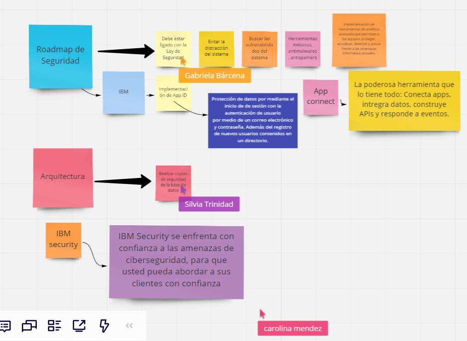

03 de Agosto de 2019

# VICTORIA-147
## Equipo: Loop-Labs
La seguridad informática, debe ser una de las prioridades en el desarrollo de cualquier proyecto (nivel empresa y/o producto). En este caso para VCITORIA-147, el punto principal es resguardar y proteger la información de las emprendedoras. Por lo tanto, en nuestro roadmap presentamos las siguientes propuestas, con el objetivo de hacer mayor énfasis en los siguientes puntos:

https://miro.com/app/board/o9J_kxc6e5k=/

https://miro.com/welcomeonboard/CUBk6tMTg3ZfCR1uZ6eFYLLcUpRQNwlE51wL12ggdwdy56VtxFwejEDsSwmrm7cF

